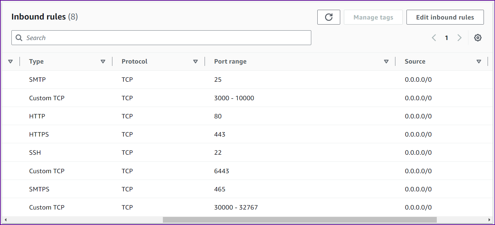

#  Setup K8-Cluster using kubeadm [K8 Version-->Latest]

### Here I have used in total 6 VMs all running Ubuntu 22.04.3 LTS

#### You can also use AWS or any other cloud service provider I have done all of this on a local setup.

#### You would also need the following ports opened on each VM

#### Ensure you have enough memory and CPU on each VM. Approximately 20-25 GB is sufficent.

