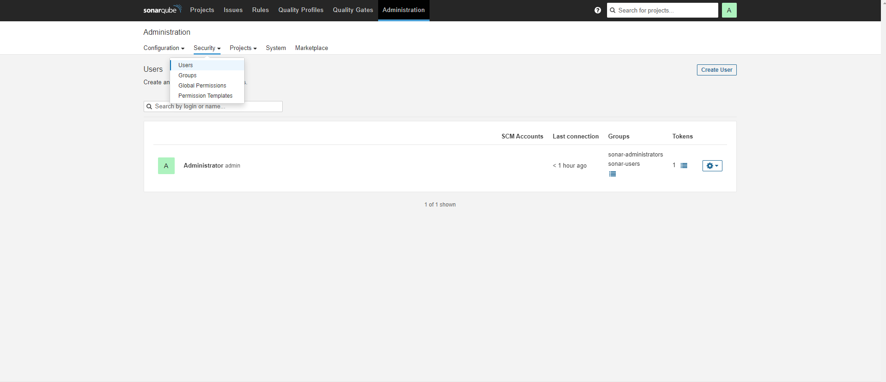

1. **SonarQube**

## We will generate and set sonarQube token in jenkins

### To generate the toke we need to login onto sonarQube server and head to administartion page then click on security and users as show below 

### Now you can see the users and a column named Tokens click on that and generate a new token that and copy it and store it.
### After we have generated the token we would now go back to jenkins and head to Dashboard -> Manage Jenkins -> Credentials. Click on global and go to add credentials. Select secret text and fill in the token we got in the step above.

2. **Docker Hub**

## You would need to setup your docker hub account cerdentails. To do this following the following steps

### Now go to jenkins and head to Dashboard -> Manage Jenkins -> Credentials. Click on global and go to add credentials. Select Username with password and fill the username and password and save it.

3. **k8-user Creation and Cred**

