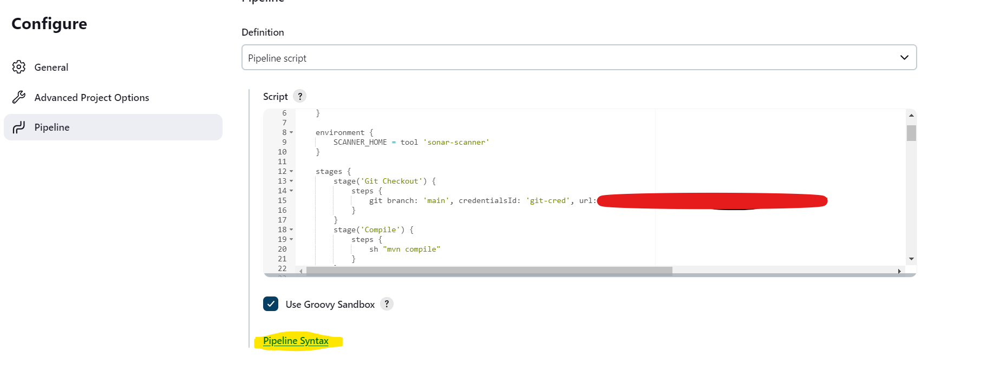

## Here how the configuration of your pipeline should look like

    - If you are wondering will you have to remember all the syntax for each stage the answer is no you don't need to what you need to know is use the syntax tool provided by Jenkins. You can find it when you are configuring your pipeline, you would see a option at the bottom(refer the image attached at the below).

    

```
pipeline {
    agent any
    tools {
        jdk 'jdk17'
        maven 'maven3'
    }

    environment {
        SCANNER_HOME = tool 'sonar-scanner'
    }

    stages {
        stage('Git Checkout') {
            steps {
                git branch: 'branch name', credentialsId: 'Name of credentials stored in Jenkins', url: 'repoURL'
            }
        }
        stage('Compile') {
            steps {
                sh "mvn compile"
            }
        }
        stage('Test') {
            steps {
                sh "mvn test"
            }
        }
        stage('File System Scan') {
            steps {
                sh "trivy fs --format table -o trivy-fs-report.html ."
            }
        }

        stage('SonarQube Analysis') {
            steps {
                withSonarQubeEnv('sonar') {
                    sh ''' $SCANNER_HOME/bin/sonar-scanner -Dsonar.projectName=ExpenseTracker -Dsonar.projectKey=ExpenseTracker \
                            -Dsonar.java.binaries=. '''
                }
            }
        }
        stage('Quality Gate') {
            steps {
                script{
                    waitForQualityGate abortPipeline: false, credentialsId: 'sonarServer Token'
                }
            }
        }
        stage('Build') {
            steps {
                sh "mvn package"
            }
        }

        stage('Build and Tag Docker Image') {
            steps {
                script {
                    withDockerRegistry(credentialsId: 'docker cred name in Jenkins ') {
                        sh "docker build -t username/projectName:latest ."
                    }
                }
            }
        }

        stage('Docker Image Scan') {
            steps {
                sh "trivy image --format table -o trivy-image-report.html userName/projectName:latest"
            }
        }

        stage('Push Docker Image') {
            steps {
                script {
                    withDockerRegistry(credentialsId: 'docker cred name in Jenkins ') {
                        sh "docker push userName/projectName:latest"
                    }
                }
            }
        }

        stage('Deploy To Kubernetes') {
            steps {
                withKubeConfig(caCertificate: '', clusterName: 'kubernetes-- if you follow the steps provided in part 1 then this would be your cluster name', contextName: '', credentialsId: 'k8 credentail id in jenkins', namespace: 'webapps', restrictKubeConfigAccess: false, serverUrl: 'Kuberenets Cluster masternode url:6443') {
                    sh "kubectl apply -f deployment-service.yaml"
                }
            }
        }

        stage('Verify Deployment') {
            steps {
                withKubeConfig(caCertificate: '', clusterName: 'kubernetes', contextName: '', credentialsId: 'k8 credentail id in jenkins', namespace: 'webapps', restrictKubeConfigAccess: false, serverUrl: 'MasterNode public ip:6443') {
                    sh "kubectl get pods -n webapps"
                    sh "kubectl get svc -n webapps"
                }
            }
        }

    }

    post {
    always {
        script {
            def jobName = env.JOB_NAME
            def buildNumber = env.BUILD_NUMBER
            def pipelineStatus = currentBuild.result ?: 'UNKNOWN'
            def bannerColor = pipelineStatus.toUpperCase() == 'SUCCESS' ? 'green' : 'red'

            def body = """
                <html>
                <body>
                <div style="border: 4px solid ${bannerColor}; padding: 10px;">
                <h2>${jobName} - Build ${buildNumber}</h2>
                <div style="background-color: ${bannerColor}; padding: 10px;">
                <h3 style="color: white;">Pipeline Status: ${pipelineStatus.toUpperCase()}</h3>
                </div>
                <p>Check the <a href="${BUILD_URL}">console output</a>.</p>
                </div>
                </body>
                </html>
            """

            emailext (
                subject: "${jobName} - Build ${buildNumber} - ${pipelineStatus.toUpperCase()}",
                body: body,
                to: 'yourEmailAddress',
                from: 'jenkins@example.com',
                replyTo: 'jenkins@example.com',
                mimeType: 'text/html',
                attachmentsPattern: 'trivy-image-report.html'
            )
        }
    }
}
}

```
